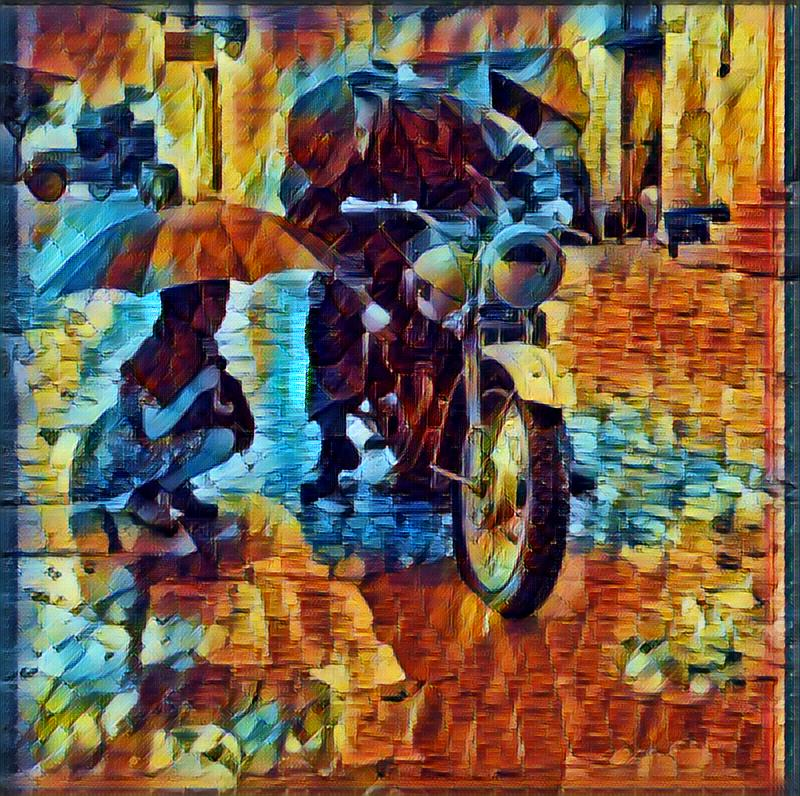

## ThePrincessDAO



ThePrincessDAO是持有the-princess-dao著作權的Decentralized autonomous organization(DAO)，用來測試與探索DAO在分散式智財管理的實務應用。

ThePrincessDAO Account = 0x565ff487b6bde426c0d2ee405e90231a3d09bbab

https://kovan.etherscan.io/address/0x565ff487b6bde426c0d2ee405e90231a3d09bbab

the-princess-dao利用fast-style-transfer專案學習Leonid Afremov的Rain Princess畫風加上英國政府釋出1943年的public domain授權照片合成，本著作以創用CC 姓名標示 4.0 國際 授權條款釋出。詳細授權條款，請至http://creativecommons.org/licenses/by/4.0/ 。

#### Fast Style Transfer in floydhub

```
$ floyd run --gpu --env keras:py2 --data Js534T344XYBPMvWqhxJNj "python evaluate.py --allow-different-dimensions --checkpoint /input/rain_princess.ckpt --in-path ./images/ --out-path /output/"
```

#### References
* artist Leonid Afremov making a recreation of Rain Princess - YouTube https://www.youtube.com/watch?v=iANCevmDzTI
* https://commons.wikimedia.org/wiki/File%3AA_little_girl_holding_an_umbrella_watches_a_despatch_rider_attempt_to_clear_the_carbuerettor_of_his_motorcycle_in_torrential_rain%2C_4_October_1943._NA7526.jpg
* Decentralized autonomous organization - Wikipedia  https://en.wikipedia.org/wiki/Decentralized_autonomous_organization
* AragonOne/aragon https://github.com/AragonOne/aragon/releases
* Style Transfer - FloydHub  http://docs.floydhub.com/guides/style_transfer/
* The DAO (organization) - Wikipedia  https://en.wikipedia.org/wiki/The_DAO_(organization)
* 被稱為心理治療效用的藝術，Leonid Afremov撼動人心的油畫世界！ | 時尚華爾滋  http://www.fashionwaltz.com/?p=3693
* 「你的名字」電影濾鏡火爆的背後 - INSIDE 硬塞的網路趨勢觀察  https://www.inside.com.tw/2016/12/04/your-name-filter

## DarkOrangeCo

DarkOrangeCo Account = 0x49655afc08a30223cb36438d085362e04404ff85

https://kovan.etherscan.io/address/0x49655afc08a30223cb36438d085362e04404ff85

### References
* darkorange at master · y12studio/dltdojo  https://github.com/y12studio/dltdojo/tree/master/docs/chains/darkorange
