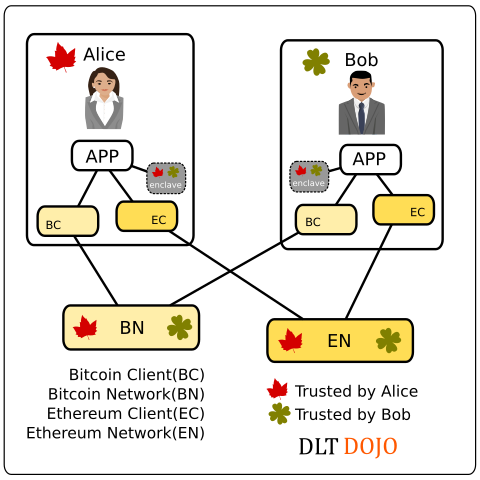

### Projects
* https://github.com/bitcoin/
* https://github.com/ethereum/
* https://github.com/hyperledger/fabric
* https://github.com/corda/corda
* https://github.com/chain/chain
* https://wiki.hyperledger.org/projects/iroha.md
* https://wiki.hyperledger.org/projects/sawtooth-lake.md
* https://github.com/jpmorganchase/quorum
* https://github.com/dragonchain/dragonchain
* https://github.com/monero-project/monero
* https://github.com/kadena-io/juno
* https://github.com/lhartikk/naivechain


### Demo site
* https://y12studio.github.io/dltdojo/

### Resources
* EU Parliament Report Explores Blockchain's 'Substantial Impact' - CoinDesk http://www.coindesk.com/eu-parliament-report-explores-blockchains-substantial-impact/
* Distributed ledger in payment, clearing and settlement - an analytical framework http://www.bis.org/cpmi/publ/d157.htm
* DLT介紹 EU Securities Watchdog: New DLT Regulations Would Be 'Premature' - CoinDesk http://www.coindesk.com/eu-securities-watchdog-new-dlt-regulations-premature/
* Blockchain: The Invisible Technology That's Changing the World | PCMag.com  http://www.pcmag.com/article/351486/blockchain-the-invisible-technology-thats-changing-the-wor
* What’s in a Name? From Bitcoin to Blockchain to Distributed Ledgers - CoinDesk  http://www.coindesk.com/whats-in-a-name-from-bitcoin-to-blockchain-to-distributed-ledgers/
* Fintech 2017: Movements in blockchain, PSD2 and cybersecurity on the horizon https://www.siliconrepublic.com/enterprise/psd2-blockchain-fintech-2017
* Blockchain Value Analysis for Investment Banks | Accenture https://www.accenture.com/gr-en/insight-banking-on-blockchain
* Bits on blocks | Thoughts on blockchain technology  https://bitsonblocks.net/
* 小蚁张铮文：写给CTO的主流区块链架构横向剖析_巴比特 http://www.8btc.com/blockchain-architecture
* Hyperledger Fabric1.0架构概览_巴比特 http://www.8btc.com/hyperledger-fabric1-0
* Project Jasper: Lessons From Bank of Canada's First Blockchain Project - CoinDesk  http://www.coindesk.com/project-jasper-lessons-bank-of-canada-blockchain-project/

### Ethereum
* Ethereum Client Implementations - EntEthAlliance - https://entethalliance.atlassian.net/wiki/display/EEA/Ethereum+Client+Implementations
* ConsenSys/smart-contract-best-practices  https://github.com/ConsenSys/smart-contract-best-practices
* slockit/DAO: The Standard DAO Framework, inc. Whitepaper  https://github.com/slockit/DAO
* ConsenSys/Tokens: Ethereum Token Contracts  https://github.com/ConsenSys/Tokens
* boardroom-contracts/contracts  https://github.com/boardroom-project/boardroom-contracts/tree/master/contracts
* numerai/contract: The Numeraire Ethereum Smart Contract  https://github.com/numerai/contract

### Contracts
* Proposal for Ricardian Contracts in Open Bazaar  https://gist.github.com/drwasho/a5380544c170bdbbbad8
* Colored Coins and Ricardian Contracts - Coinprism Blog  http://blog.coinprism.com/2014/12/10/colored-coins-and-ricardian-contracts/
* On the intersection of Ricardian and Smart Contracts  http://iang.org/papers/intersection_ricardian_smart.html
* The Case for Dumb Contracts – Medium  https://medium.com/@therealopenbazaar/the-case-for-dumb-contracts-6308aa5b757
* Blockchain and supply chain examples  http://www.fintechblue.com/2016/08/blockchain-supply-chain-examples/
* domschiener/cargochain: Shanghai Blockchain Hackathon winning project  https://github.com/domschiener/cargochain

### Fact/Prediction/Token
* Reality Keys - Facts about the future, cryptographic proof when they come true  https://www.realitykeys.com/
* Oraclize  https://github.com/oraclize
* Daily Price Oracles » Brave New Coin http://bravenewcoin.com/services/oracles/daily-price-oracles
* An AI Hedge Fund Created a New Currency to Make Wall Street Work Like Open Source | WIRED  https://www.wired.com/2017/02/ai-hedge-fund-created-new-currency-make-wall-street-work-like-open-source/
* Numerai Used 7,500 Faceless Coders Paid in Bitcoin to Build Its Hedge Fund's Brain | WIRED  https://www.wired.com/2016/12/7500-faceless-coders-paid-bitcoin-built-hedge-funds-brain/
* A New Cryptocurrency For Coordinating Artificial Intelligence on Numerai – Numerai – Medium  https://medium.com/numerai/a-new-cryptocurrency-for-coordinating-artificial-intelligence-on-numerai-9251a131419a
* Decentralized Prediction Markets | Augur Project  https://augur.net/
* Make complex predictions with an easy to use prediction market | GNOSIS  https://gnosis.pm/

### United Nations
* UN Working Paper Explores How the Blockchain Can Empower Global Communities | Bitcoin Magazine  https://bitcoinmagazine.com/articles/un-working-paper-explores-how-the-blockchain-can-empower-global-communities-1455648791/
* Sustainable Development Goals  https://sustainabledevelopment.un.org/
* The UN Needs Blockchain to Achieve Its Goals - Blockgeeks  http://blockgeeks.com/the-un-needs-blockchain/
* Call for a Digital Geneva Convention Could Affect Bitcoin - Bitcoin News  https://news.bitcoin.com/call-for-a-digital-geneva-convention-could-affect-bitcoin/
* 微软呼吁签署《数字日内瓦公约》，比特币矿工和交易者理应成为保护对象_巴比特  http://www.8btc.com/digital-geneva-convention-could-affect-bitcoin
* How to Sue A Decentralized Autonomous Organization - CoinDesk  http://www.coindesk.com/how-to-sue-a-decentralized-autonomous-organization/

### Trusted Execution Environments (TEEs)



* Hardware Oracles: bridging the Real World to the Blockchain https://blog.ledger.co/hardware-oracles-bridging-the-real-world-to-the-blockchain-ca97c2fc3e6c
* Scaling Bitcoin with Secure Hardware  http://hackingdistributed.com/2016/12/22/scaling-bitcoin-with-secure-hardware/
* Implementing a trustless security solution with hardware wallets and multisignature – Medium
 https://medium.com/@Ledger/implementing-a-trustless-security-solution-with-hardware-wallets-and-multisignature-8f50732c6f4c
* The Teechan Solution: Scaling Bitcoin With Trusted Hardware | Bitcoin Magazine
 https://bitcoinmagazine.com/articles/the-teechan-solution-scaling-bitcoin-with-trusted-hardware-1482956340/

### Bank Note
* Banknote - Wikipedia https://en.wikipedia.org/wiki/Banknote
* Canadian Bank Notes and Dominion Notes: Lessons for Digital Currencies http://www.bankofcanada.ca/wp-content/uploads/2017/02/swp2017-5.pdf
* Bank of Canada draws digital currencies lessons from history » Brave New Coin  http://bravenewcoin.com/news/bank-of-canada-draws-digital-currencies-lessons-from-history/

### Healthcare

* Blockchain Technology in Healthcare: The Dream And The Reality  https://thenextweb.com/contributors/blockchain-technology-healthcare-dream-reality/

### Apache spot

Apache Spot以網路巨量資料的建立與安全分析並分享分析工具為主，未來千帳萬鏈時代，一天億萬筆資產智約交易的監控、分析結果也可因聯防安全互助或是智約需要的成立條件而藉由open data model (ODM) 分享。

概念可參考目前apache spot提供的opennetworkinsight/oni-demo，只是不分析封包而可能是分析當下交易合約的比特幣標的物與比特幣目前網路的費率壅塞等等交叉分析是否有安全疑慮。比特幣目前的交易量雖然看不出有一天數億的處理量，不過串上閃電網路/側網/數位法幣/ETH/Hyperledger/Corda/Chain等等資產帳要分析時，這類數據只會倍增。

* Apache Spot Overview and Demo - YouTube  https://www.youtube.com/watch?v=tWlRQKI4I6o
* Apache推出新開源專案Spot，用機器學習加強網路弱點分析 | iThome  http://www.ithome.com.tw/news/108718
* Apache Spot (incubating) Documentation  http://spot.incubator.apache.org/doc/
* incubator-spot/open-data-model.md at master · apache/incubator-spot https://github.com/apache/incubator-spot/blob/master/docs/open-data-model/open-data-model.md
* apache/incubator-spot: Mirror of Apache Spot https://github.com/apache/incubator-spot
* 區塊鏈衝擊傳統事務所，KPMG將數位轉型探索全新的審計模式 | iThome  http://www.ithome.com.tw/news/111883

### Copyright

未來的著作權授權合約走向分散式分潤是否可讓原始著作權人擁有較多權利還有待觀察，跟某著作權協會簽約或是用SingularDTV的合約在ETH平台上締約，主要差異是分潤透明，收取權益不經過第三方。

* Blockchain to Disrupt Balance of Power in TV, Music and Film Industry  https://cointelegraph.com/news/blockchain-to-disrupt-balance-of-power-in-tv-music-and-film-industry
* 区块链将打破电视、音乐和电影业的平衡，让利益回归内容创作者_巴比特  http://www.8btc.com/blockchain-to-disrupt-balance-of-power
* ConsenSys/singulardtv-contracts  https://github.com/ConsenSys/singulardtv-contracts
* 'Bowie bonds' - the singer's financial innovation - BBC News  http://www.bbc.com/news/business-35280945
* The second coming of blockchain | Intel® Software https://software.intel.com/en-us/blogs/2017/02/14/the-second-coming-of-blockchain
* Open Music Initiative - Wikipedia  https://en.wikipedia.org/wiki/Open_Music_Initiative
* Musicoin https://github.com/Musicoin
* COALAIP/specs: COALA IP Specification  https://github.com/COALAIP/specs

### online courses
* anders的開源區塊鏈教材專案，推薦實際操作練習。anders Blockchain Demo https://anders.com/blockchain/
* Microsoft Blockchain as a Service - Microsoft Virtual Academy  https://mva.microsoft.com/en-US/training-courses/microsoft-blockchain-as-a-service-17104
* Microsoft Virtual Academy Blockchain As A Service Course https://decentralize.today/microsoft-virtual-academy-blockchain-as-a-service-course-d6c9be7abb4d#.sv5wfzekk

### IoT

* Blockchain: transforming the IoT’s security vulnerability into a strategic advantage  https://internetofbusiness.com/blockchain-iot-security-2/
* Flowchain https://github.com/flowchain

### Car Wallet
* 比特幣車錢包的IBM i3 API試驗案例，日前另一個Project Oaken使用ETH與Tesla當試驗示範平台。
* EthanBIoT CarWallet - YouTube https://www.youtube.com/watch?v=_exyzLOnMJw
* Blockchain Car Wallet: The First Of Its Kind - Blockgeeks http://blockgeeks.com/blockchain-car-wallet/
* Project Oaken https://www.projectoaken.com/

### Voting

* Voatz is using Blockchain technology to help you conveniently and securely cast your vote - IBM Global Entrepreneur  http://developer.ibm.com/startups/wp-content/uploads/sites/72/2016/11/voatz-demo.png
* New Blockchain Partnership Proposes Solution for Remote Voting - CryptoCoinsNews  https://www.cryptocoinsnews.com/new-blockchain-partnership-proposes-solution-remote-voting/
* After Chaotic First Day, Bitcoin Foundation Reboots Run-off Election | Bitcoin Magazine  https://bitcoinmagazine.com/articles/developing-story-bitcoin-foundation-elections-shambles-candidates-call-restart-1424917704/
* 「無人管理」的區塊鏈新創The DAO，創下史上高額群眾募資紀錄：1.25億美元｜數位時代  https://www.bnext.com.tw/article/39603/BN-2016-05-17-172239-218

### Corda Messaging

Corda的訊息網路層是抽象化作法，目前使用既有AMQP協定實做Apache ActiveMQ Artemis，不過巨量看來轉Apache Kafak或是客製的uber cherami應該也可，就現有訊息網路實戰部署上來看，後兩者的吞吐量以及社群開發動能應該都沒有問題。

* corda/Messaging.kt at master · corda/corda  https://github.com/corda/corda/blob/master/core/src/main/kotlin/net/corda/core/messaging/Messaging.kt
* corda/ArtemisMessagingServer.kt at master · corda/corda  https://github.com/corda/corda/blob/master/node/src/main/kotlin/net/corda/node/services/messaging/ArtemisMessagingServer.kt
* apache/activemq-artemis: Mirror of Apache ActiveMQ Artemis  https://github.com/apache/activemq-artemis
* uber/cherami-server: Distributed, scalable, durable, and highly available message queue system.  https://github.com/uber/cherami-server
* Cherami：Uber Engineering的可持续和可扩展的任务队列  http://www.infoq.com/cn/articles/cherami-uber-engineering-task-queue

### LibreTaxi

相較於先籌代幣做不出來面臨散伙的Arcade City，自由計程車專案LibreTaxi是先有網路再加上加密貨幣支付，這個開源專案依附Telegram與Google Firebase兩個網路運作，很容易在網路上建立一個新的自由計程車站台推送資訊，後續加上比特幣或是智能合約的應用應該很快可以見到。

* Как работает LibreTaxi.org в Гоа. Такси в Гоа (HD) - YouTube  https://www.youtube.com/watch?v=0nUQQDnCBlM
* Uber But for Places Where Uber Would Never Go | | Observer  http://observer.com/2017/02/libretaxi-uber-ridesharing/
* Free and open source alternative to Uber/Lyft connecting passengers and drivers.  http://libretaxi.org/
* Add support for Bitcoin payments · ro31337/libretaxi https://github.com/ro31337/libretaxi/issues/429
* Arcade City Is the ‘Black Market’ Uber that Runs on Facebook - Motherboard  https://motherboard.vice.com/en_us/article/arcade-city-is-the-black-market-uber-that-runs-on-facebook-christopher-david

### Machine Learning

開發者入門必讀：最值得看的十大機器學習公開課_幫趣網  http://bangqu.com/gpu/blog/5374

### Bitcoin Mirror World

目前做比特幣網路鏡世界一比一模擬約需6000個節點，以上次踢館壹道場開20個模擬比特幣節點來估，全球各大洲布300個道場連線模擬做實驗成本不低。

* Miniature World: Measuring and Evaluating Blockchains  http://hackingdistributed.com/2017/02/10/miniature-world/
* 丁丁糖：《奇異博士》里的科學原理 - 每日頭條  https://kknews.cc/zh-tw/news/g2b6589.html

### Law
* 民法§345-全國法規資料庫入口網站 http://law.moj.gov.tw/LawClass/LawSingle.aspx?Pcode=B0000001&FLNO=345

### SANDBOX

Regulatory sandbox | FCA  https://www.fca.org.uk/firms/project-innovate-innovation-hub/regulatory-sandbox

### SQL
* How to use web3.js to sign a contract call — Ethereum Community Forum  https://forum.ethereum.org/discussion/5039/how-to-use-web3-js-to-sign-a-contract-call

sql concept code
```
('INSERT INTO accounts (balance, id) VALUES (9988, toAccount)').sign(privatekey)
```

ethereum concept code
```
var SolidityFunction = require('web3/lib/web3/function');
var solidityFunction = new SolidityFunction('', _.find(ABI, { name: 'sendCoin' }), '');
var payloadData = solidityFunction.toPayload([toAccount, 9988]).data;
var tx = {
    to: toAccount,
    from: fromAccount,
    data: payloadData
};
tx.sign(privateKey);
```
