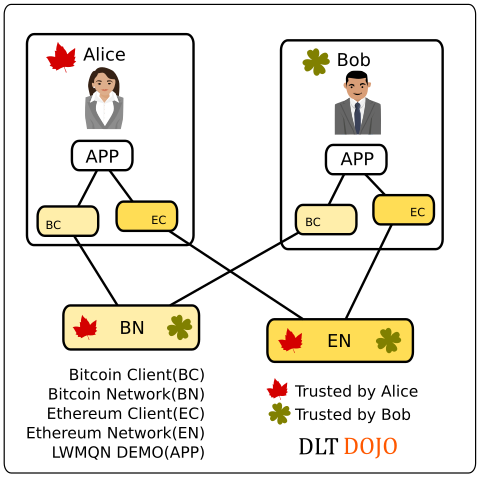

## TiGuan5



### PROJECTS
* A simple smart home webappp demo https://github.com/lwmqn/lwmqn-demo
* https://github.com/y12studio/lwmqn-demo
* Bitcoin Core https://github.com/bitcoin/bitcoin
* Ethereum https://github.com/ethereum/go-ethereum
* https://github.com/bitcoin-abe/bitcoin-abe
* https://github.com/JornC/bitcoin-transaction-explorer
* https://github.com/carsenk/explorer

### PEERS
* BitcoinCore regtest chain x5
* Ethereum dev chain x1
* lwmqn-demo x3

### SERVICES
* Bitcoin abe explorer http://hostip:12750
* Bitcoin jornc explorer http://hostip:12751
* Ethereum carsenk explorer http://hostip:18000
* lwmqn-demo0 http://hostip:13000
* lwmqn-demo1 http://hostip:13001
* lwmqn-demo2 http://hostip:13002

### SMART CONTRACTS
* https://github.com/y12studio/dltdojo/blob/master/dockerfiles/lwmqn-demo/dltdojo.js
* https://github.com/y12studio/dltdojo/blob/master/lib/Tiguan5Coin.sol
* https://github.com/y12studio/dltdojo/tree/master/dockerfiles/lwmqn-demo

### SETUP
```
$ git clone --depth=1 https://github.com/y12studio/dltdojo.git
$ cd dltdojo/dockerfiles/lwmqn-demo
$ source alias.sh
$ HOSTIP=`ip route get 1 | awk '{print $NF;exit}'`
$ sed -i.bak "s/192.168.2.73/$HOSTIP/g" docker-compose.yml
$ dcup
$ docker ps --format "{{.Names}}  {{.Ports}}"
dclwmqn_carexp_1  0.0.0.0:18000->8000/tcp
dclwmqn_ethdev_1  8332-8333/tcp, 18332-18333/tcp, 18444/tcp, 0.0.0.0:8545->8545/tcp
dclwmqn_btcboot_1  8332-8333/tcp, 18332-18333/tcp, 18444/tcp, 0.0.0.0:13000->3000/tcp, 0.0.0.0:13030->3030/tcp
dclwmqn_btc1_1  8332-8333/tcp, 18332-18333/tcp, 18444/tcp, 0.0.0.0:13001->3000/tcp, 0.0.0.0:13031->3030/tcp
dclwmqn_abe_1  0.0.0.0:12750->12750/tcp
dclwmqn_btc2_1  8332-8333/tcp, 18332-18333/tcp, 18444/tcp, 0.0.0.0:13002->3000/tcp, 0.0.0.0:13032->3030/tcp
dclwmqn_jorexp_1  0.0.0.0:12751->8080/tcp
dclwmqn_dltdojo_1  0.0.0.0:18168->18168/tcp

```
### Bitcoin TEST
```
$ dj btc btcboot miner --num 101
$ dj btc btc1 account --new
mhPJnz7yVPyuBihfCqfqAWzwHciodqJDpu
$ dj btc btc2 account --new
mo3y4JZDWas4Z5Xky6puAQdGXvvpSJKcKS
$ dj btc btcboot send --to mhPJnz7yVPyuBihfCqfqAWzwHciodqJDpu --btc 20
$ dj btc btcboot send --to mo3y4JZDWas4Z5Xky6puAQdGXvvpSJKcKS --btc 20
$ dj btc btcboot miner --num 1
$ dj btc btc1 info && dj btc btc2 info
{ version: 130200,
  protocolversion: 70015,
  walletversion: 130000,
  balance: 20,
  blocks: 102,
  timeoffset: 0,
  connections: 1,
  proxy: '',
  difficulty: 4.656542373906925e-10,
  testnet: false,
  keypoololdest: 1487763145,
  keypoolsize: 100,
  paytxfee: 0,
  relayfee: 0.00001,
  errors: '' }
{ version: 130200,
  protocolversion: 70015,
  walletversion: 130000,
  balance: 20,
  blocks: 102,
  timeoffset: 0,
  connections: 1,
  proxy: '',
  difficulty: 4.656542373906925e-10,
  testnet: false,
  keypoololdest: 1487763144,
  keypoolsize: 100,
  paytxfee: 0,
  relayfee: 0.00001,
  errors: '' }
// go to http://hostip:12750
// go to http://hostip:12751
// go to http://hostip:13000
// go to http://hostip:13001
// go to http://hostip:13002
```
### Ethereum TEST
```
$ dj eth ethdev account --new --password pass
0x7f2b02b4092e3da7ccff8144be388ea30265616d
$ ADDR=0x7f2b02b4092e3da7ccff8144be388ea30265616d
$ dj eth ethdev miner --start
{ jsonrpc: '2.0',
  id: '6a0ddd67-ad60-4e06-911c-999abfb8d965',
  result: true }
$ dj eth ethdev account --list
{ '0x7f2b02b4092e3da7ccff8144be388ea30265616d': { balance: '5000000000000000000', ethBalance: '5' } }
$ dj eth ethdev tiguan5coin --new --address $ADDR --password pass
{ tx: '0x29f42832c68016d83ce75a49d4171dedf10ddac3b5e0fed4ff4b993fdd2ccd73',
  contractAddress: '0x7a22ff44b0080d26874126e9ac3056fa531bb13f' }
$ CADDR=0x7a22ff44b0080d26874126e9ac3056fa531bb13f
$ dj eth ethdev tiguan5coin --address $ADDR --contract $CADDR
{ account: '0x7f2b02b4092e3da7ccff8144be388ea30265616d',
  contractAddress: '0x7a22ff44b0080d26874126e9ac3056fa531bb13f',
  contractBalance: '21000000' }
$ dj eth ethdev tiguan5coin --address $XADDR --contract $CADDR
{ account: '0xef360a8b39442dc87c60aa957b07016cb396f164',
  contractAddress: '0x7a22ff44b0080d26874126e9ac3056fa531bb13f',
  contractBalance: '100' }
$ dj eth ethdev tiguan5coin --address $YADDR --contract $CADDR
{ account: '0x0028e590fc2789a2ae4da1824780390a3bc483a8',
  contractAddress: '0x7a22ff44b0080d26874126e9ac3056fa531bb13f',
  contractBalance: '200' }
$ dj eth ethdev tiguan5coin --address $ZADDR --contract $CADDR
{ account: '0x4c41deb7f34a6e625458d62f3fb6553545e9ecfd',
  contractAddress: '0x7a22ff44b0080d26874126e9ac3056fa531bb13f',
  contractBalance: '300' }
$ dj eth ethdev tiguan5coin --send --to 0x93d5dc01a675abb8de4a810b94d24189c0359d8a --address $ADDR --password pass --contract $CADDR --amount 99
$ dj eth ethdev tiguan5coin --address 0x93d5dc01a675abb8de4a810b94d24189c0359d8a --contract $CADDR
{ account: '0x93d5dc01a675abb8de4a810b94d24189c0359d8a',
  contractAddress: '0x7a22ff44b0080d26874126e9ac3056fa531bb13f',
  contractBalance: '99' }
$ dj eth ethdev tiguan5coin --address $XADDR --contract $CADDR
{ account: '0xef360a8b39442dc87c60aa957b07016cb396f164',
  contractAddress: '0x7a22ff44b0080d26874126e9ac3056fa531bb13f',
  contractBalance: '101' }
$ dj eth ethdev tiguan5coin --address $YADDR --contract $CADDR
{ account: '0x0028e590fc2789a2ae4da1824780390a3bc483a8',
  contractAddress: '0x7a22ff44b0080d26874126e9ac3056fa531bb13f',
  contractBalance: '202' }
```
### Credits

Fork of  https://github.com/lwmqn/lwmqn-demo projet. All credit goes to simen.
